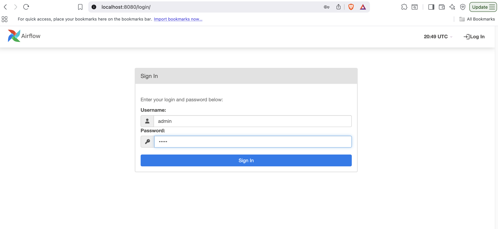
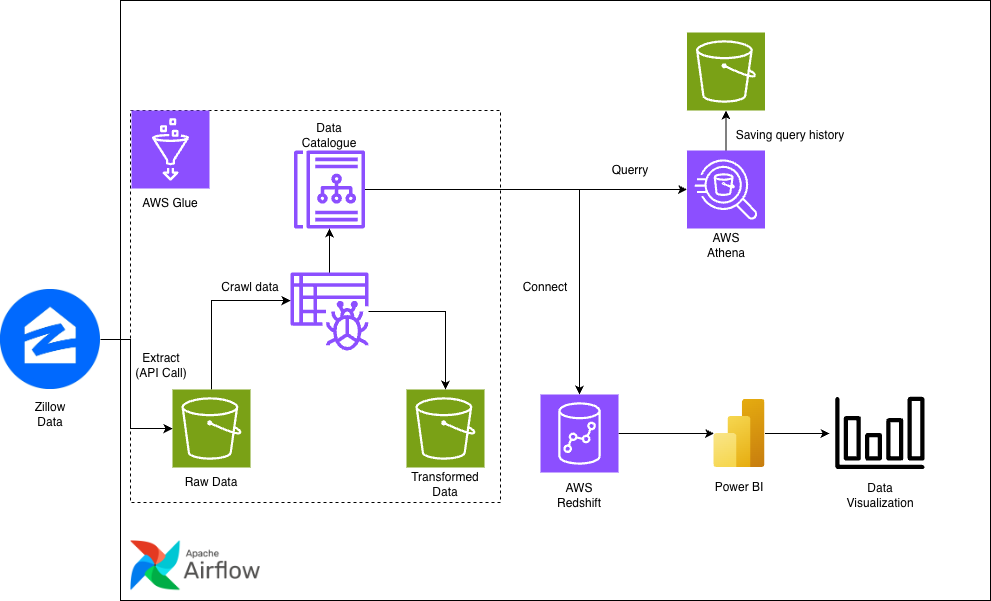
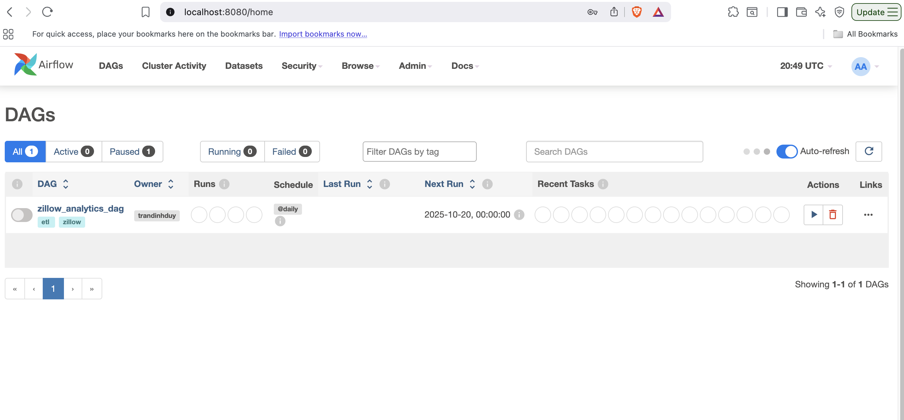
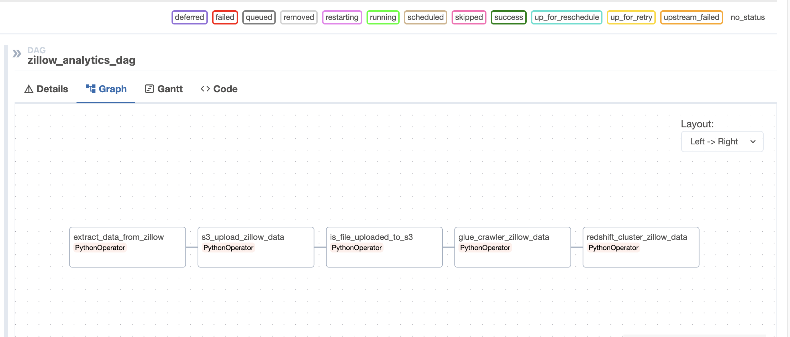
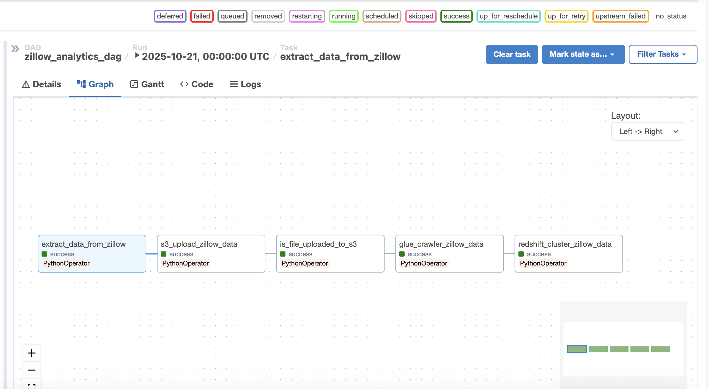

# 🚀 Project Name

Zillow API ETL Project

---

## Overview

This project is designed to make a data pipeline for processing Zillow data. It is a practical project by Tran Dinh Duy in his journey to become a Data Engineer.
Built with modern technologies it aims to provide eng-to-end data pipeline for extract - transform - load Zillow data.

---

## Features

- **Feature 1** – Using Docker to dockerize the project and run Apache Airflow, Redis, and Postgres database. 
- **Feature 2** – Extracting Zillow raw data from Zillow API and load to AWS S3.  
- **Feature 3** – Using AWS Glue to crawl data from S3, to infer the schema, and to do data transformation.
- **Feature 4** – The transformed data could be queried by using AWS Athena or AWS Redshift serverless.
- **Feature 5** – Connect Power BI with Athena for data visualization.

---

## Tech Stack

| Category | Technologies |
|-----------|---------------|
| Orchestration | Apache Airflow |
| Data Visualization | Power BI |
| Database | Redis, Postgres, AWS Redshift |
| Other | Docker, AWS S3, AWS Glue, AWS Athena, AWS IAM |

---

## Architecture

## Application

## Data Pipelines

